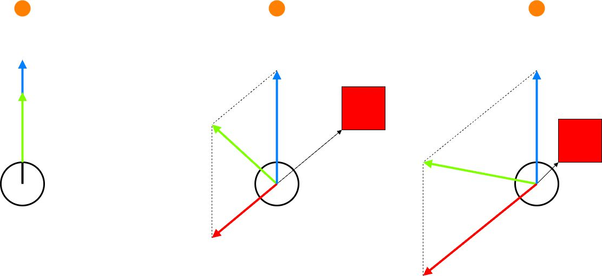
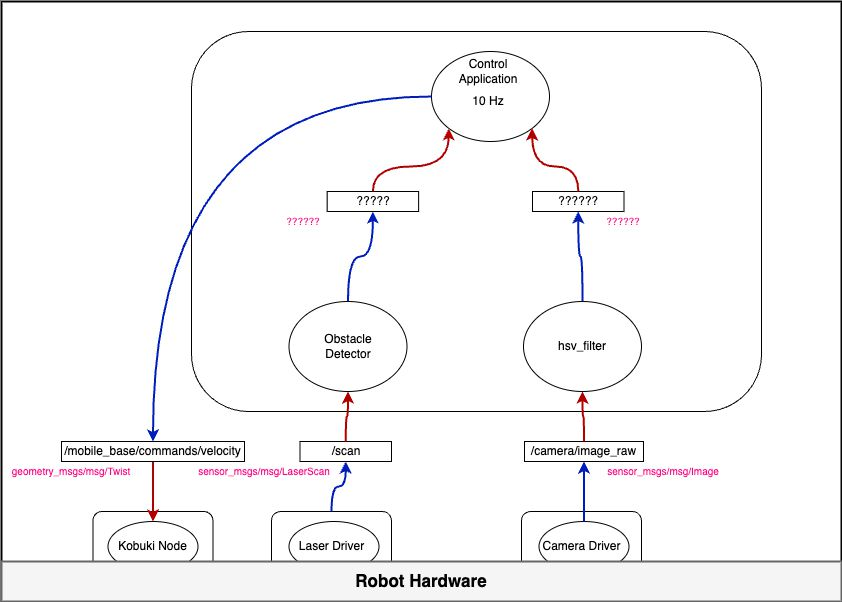

# Práctica 5: Búsqueda y seguimiento de una pelota
Crea una aplicación en ROS 2 que haga que un robot busque y siga una pelota de un color característico, esquivando los obstáculos que se encuentre en su camino, usando VFF.

- Debes crear un paquete que tenga un nodo que use la salida de los nodos que ya existen en
https://github.com/URJC-teaching/asr-clase/tree/main/sensors, con ligeras modificaciones. No debes copiar ni
cheros ni código a tu paquete nuevo, solo modificarlos en su ubicación original.

- La modificación de los nodos consiste en que cada uno publique los componentes necesarios de un vector atractivo,
en el caso de hsv_filter o un vector repulsivo, en el caso de ObstacleDetector. Puedes usar
geometry_msgs/msg/Vector3 o cualquier interfaz que te parezca adecuada (tendrás que crear una nueva interfaz de
mensaje en un paquete).

- El nodo desarrollado debe tener dos estados:

- Uno para cuando no percibe el objeto, en el que gira hacia un lado. Por ejemplo, podría girar siempre
hacia el mismo lado, o hacia el lado donde estaba la pelota antes de desaparecer.

- Otro cuando el objeto es percibido, en el que genera velocidades usando VFF.

- Lanza los nodos utilizando launchers (no tienes por qué lanzar todos los nodos en un launcher, sino llegar a una
solución que satisfaga el problema propuesto).

- Usa parameters para cualquier valor parametrizable: velocidades, valores del filtro, etc.

- Usa topics con nombre genérico y conéctalo con remapeos en el launcher. Usa launchers y/o configuraciones de
parámetros diferentes cuando estés en el simulador o en el robot real.

### Consejos de implementación

- El módulo del vector repulsivo no debería de ser equivalente a la distancia del obstáculo, ya que eso implicaría
que los obstáculos más lejanos, causan mayor repulsión que los más cercanos. Una posible estrategia es hacerlo
proporcional a K/d² (la constante K se puede determinar de manera experimental). Así, un objeto lejano apenas
causaría repulsión, mientras que uno cercano causaría mucha repulsión (recuerda utilizar std:clamp() para limitar
la velocidad de salida).

- Si quieres que obstáculos muy lejanos no causen repulsión, puedes establecer un umbral a partir del cual el obstáculo
detectado no se tiene en cuenta.

- Ya que no estamos utilizando imagen de profundidad, la distancia de la pelota no es conocida, por lo que tampoco
conocemos el módulo del vector atractivo. Puedes asumir que es 1 y luego multiplicarlo por una constante que
adapte la velocidad de salida.

En el robot real:

- Utiliza el topic /scan_filtered ya que tiene en cuenta algunos obstáculos fijos en el chasis del robot.

- Ten en cuenta que, debido a su colocación, los ejes del láser se encuentran invertidos. Es posible que,
después de calcular las coordenadas (x,y) del obstáculo tengas que cambiarlas de signo para saber
dónde está realmente.
