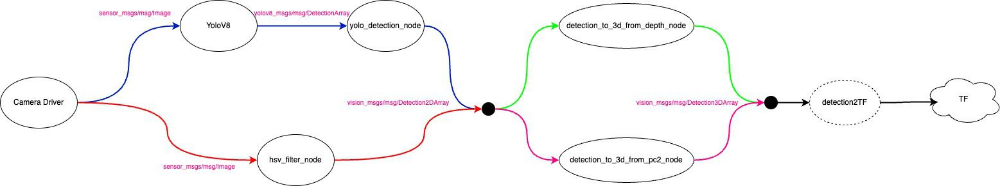

# Práctica 6: Seguimiento de una persona

Implementa un comportamiento para un robot en ROS 2 de manera que este siga a una persona (o cualquier otra
entidad según un parámetro) a un metro:
1. El robot debe acercarse y mantener la distancia de 1 metro de la entidad a seguir
2. Siempre ha de orientarse hacia la entidad
3. Cuando no vea a la entidad, ha de girar hasta que la encuentra
4. Una vez encontrada, usa un PID para aproximarse a la TF que haya producido la detección
5. Opcionalmente, se puede incluir el algoritmo VFF para esquivar obstáculos

Completa el subsistema de percepción visto en clase con un nuevo nodo que produzca TFs (odom2entity) a partir de
un 'vision_msgs/msg/Detection3DArray'. Puedes usar el nodo de detección 3D que prefieras (basado en PointCloud2 o
en imagen de profundidad).
